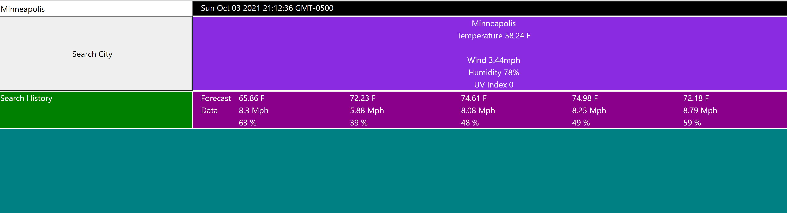

# weather-dashboard

Assignment:
Using the openweather API, create a webpage that will pull current and 5 day forecast weather info for an entered city. And save search history to local storage so that cities may be re-searched.

Screenshot:

</img>

Links:
https://github.com/Jcarps97/weather-dashboard
https://jcarps97.github.io/weather-dashboard/